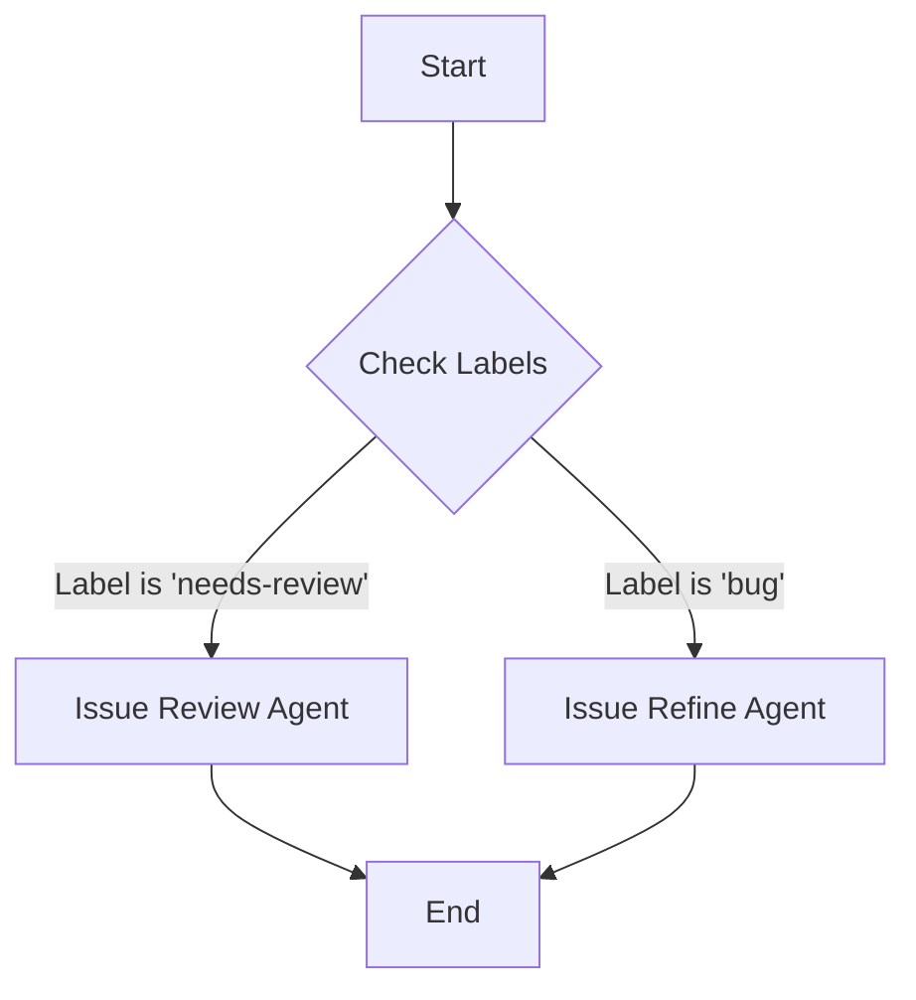

# SelfHostedAISDLC

## Setup

To configure the runner for this project, you need to set up specific Actions secrets and variables. These values allow the agents to communicate with your local LM Studio instance.

### Required Secrets/Variables

- **`LM_STUDIO_MODEL`**: Set this to the model identifier you are using (e.g., `llama-3-8b`).
- **`LM_STUDIO_URL`**: Set this to the local server address where LM Studio is running (e.g., `http://localhost:1234/v1`).

> **Note**: Check your LM Studio server logs for the active model name and the port it is listening on to ensure these values are correct.

## Agent Flow

The automation agents in this repository are triggered based on GitHub issue labels. Here is how the trigger logic works:

- **Issue Review Agent**: Triggers when a new issue is opened with the label `needs-review`.
- **Issue Refine Agent**: Triggers when an issue is labeled `bug`.

Tags like `feature` or `bug` determine which agent performs work. For example, applying the `bug` label initiates the refinement process, while `needs-review` starts the review process.

### Visual Flow

The following Mermaid diagram illustrates the agent trigger logic:

## Configuration

The behavior of the agents can be further tuned by modifying the scripts located in `.github/scripts/`. 

- **`issue-reviewer.js`**: Handles the logic for reviewing issues.
- **`issue-refine.js`**: Handles the logic for refining bug reports.
- **`issue-agent.js`**: Core agent utilities.

Ensure that any changes to these scripts align with the environment variables defined in the Setup section.