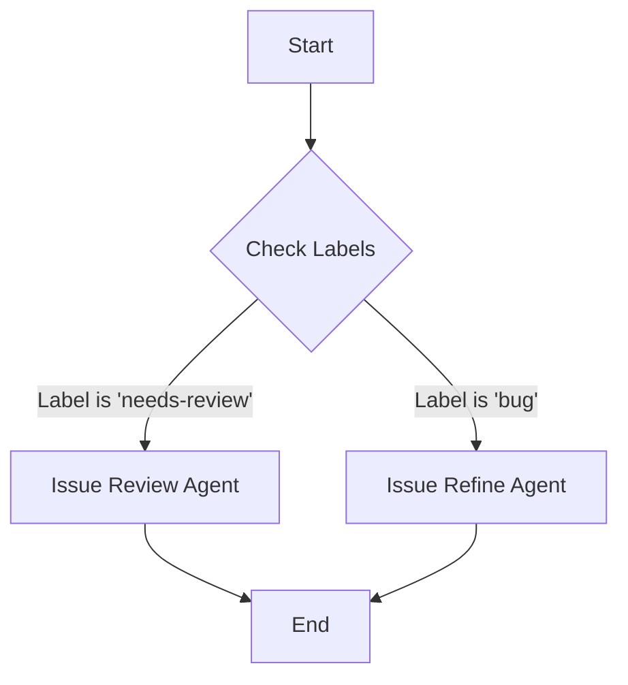

# SelfHostedAISDLC

## Setup

To configure the runner for this project, you need to set up specific Actions secrets and variables. These values allow the agents to communicate with your local AI model server.

### Required Secrets/Variables

- **`LM_STUDIO_MODEL`**: Set this to the model identifier you are using (e.g., `llama-3-8b`).
- **`LM_STUDIO_URL`**: Set this to the local server address where LM Studio is running (e.g., `http://localhost:1234/v1`).

> **Note**: Check your LM Studio server logs to find the active model name and the port it is listening on. Ensure these match the values you configure in your repository secrets.

## Agent Flow

The automation agents in this repository are triggered based on specific GitHub issue labels. This allows for a modular approach to issue handling.

### Trigger Logic

- **Issue Review Agent**: Triggers when a new issue is opened with the label `needs-review`. This agent performs an initial assessment of the issue.
- **Issue Refine Agent**: Triggers when an issue is labeled `bug`. This agent focuses on refining bug reports, ensuring they have sufficient detail and reproduction steps.

Tags like `feature` or `bug` act as signals for the workflow engine to dispatch the appropriate agent logic. For example, applying the `bug` label initiates the refinement process, while `needs-review` starts the review process.

### Visual Flow

The following Mermaid diagram illustrates the decision logic for agent triggers:

## Configuration

The behavior of the agents can be further tuned through configuration files located in the `.github/scripts/` directory. Each script corresponds to a specific agent:

- `issue-reviewer.js`: Handles the logic for the Issue Review Agent.
- `issue-refine.js`: Handles the logic for the Issue Refine Agent.
- `issue-agent.js`: Core agent utilities and shared logic.

Ensure that any custom configurations align with the secrets defined in the Setup section.